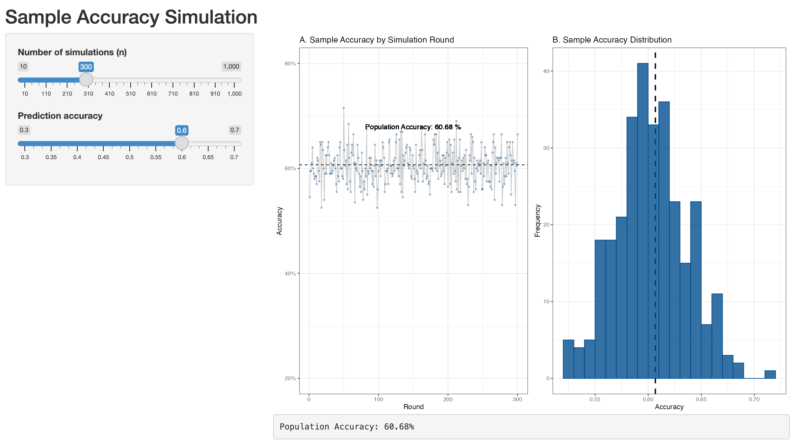

[[Enlglish]](README.EN.md) | 中文

# 大语言模型数据标注
使用大语言模型进行大规模数据标注的教程材料,包括课程幻灯片, 提及的文章和实验代码.  


# 仓库结构
```
- ./experiments/ # 本教程涉及的模拟实验代码
    - 1.classification.ipynb # 情绪和主题分类
    - 2.imputation.ipynb # 数据缺失值插补
    - 3.scaling.ipynb # 大规模处理的技巧
    - 4.simulation.ipynb # 样本总体参数
- ./papers/ # 本教程提到的文章
- ./slides/slide.pdf # 课程幻灯片
- ./README.md # [本说明]
```

# 主要内容
- 使用大语言模型进行数据标注,缺失值插补和提示工程
- 大规模处理中的技巧
- 质量评估的方法
- 大语言模型的局限

# 作者信息
欧阳荣鑫 （rongxin@u.nus.edu）新加坡国立大学传播与新媒体系博士候选人 

# 许可
MIT